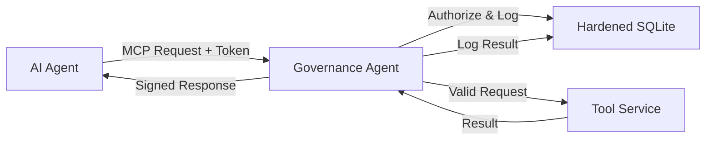

# Talos Governance Agent (TGA)

The **Talos Governance Agent (TGA)** is the high-integrity supervision layer for the Talos ecosystem. It acts as a sidecar proxy for AI agents, enforcing strict capability-based authorization, cryptographic audit logging, and crash-safe execution state tracking.

## key Features (v1.0 Production Baseline)

### 1. High-Integrity Authorization

- **Capability-Based Access Control**: Validates signed JWS Capability Tokens (Ed25519) issued by the Supervisor.
- **Fast-Path Validation**: Supports sub-millisecond authorization via secure session caching (`session_id`).
- **Strict Moore Machine**: Enforces a formal state machine (`PENDING` -> `AUTHORIZED` -> `EXECUTING` -> `COMPLETED`) for all tool calls.

### 2. Tamper-Evident Audit Logic

- **Hash-Chained Logs**: Every execution state transition is cryptographically bound to the previous state using **base64url-encoded SHA-256 digests** (RFC 8785).
- **Immutable History**: The log forms an unbroken hash chain, ensuring that any tampering with history is detectable during recovery.
- **Auditable Artifacts**: Tool inputs, outputs, and capabilities are hashed and committed to the log.

### 3. Hardened Persistence

- **Secure SQLite Core**: Uses a hardened `SqliteStateStore` with **WAL mode** enabled by default for crash safety and concurrency.
- **Zero-Trust Permissions**: Enforces `0600` (read/write only by owner) file permissions on the database file to prevent unauthorized local access.
- **Schema Versioning**: Embedded schema version tracking for safe migrations.

## Architecture

TGA sits between the AI Agent and the Tool Server (MCP):



## Usage

### Environment Variables

| Variable | Description | Default |
| :--- | :--- | :--- |
| `TGA_SUPERVISOR_PUBLIC_KEY` | PEM-encoded Ed25519 public key of the Supervisor | (Dev Key) |
| `TGA_DB_PATH` | Path to the SQLite database file | `governance_agent.db` |
| `LOG_LEVEL` | Logging verbosity | `INFO` |

### Running the Service

TGA runs as a standard MCP server.

```bash
# Install dependencies
uv sync

# Run the server
export TGA_DB_PATH="./prod_tga.db"
uv run python -m talos_governance_agent.main
```

### Verification

Run the high-integrity test suite to verify compliance:

```bash
uv run pytest tests/test_governance.py
```

## Security

- **Supply Chain**: Verified with `pip-audit`.
- **Cryptography**: Uses `cryptography` and `PyJWT` libraries with strict algorithm pinning (`EdDSA`).
- **No Plaintext Secrets**: Capability tokens are bearer tokens; the TGA does not store long-lived secrets other than its own identity keys (if configured).

## License

Licensed under the Apache License 2.0. See [LICENSE](LICENSE).

Licensed under the Apache License 2.0. See [LICENSE](LICENSE).

Apache 2.0
